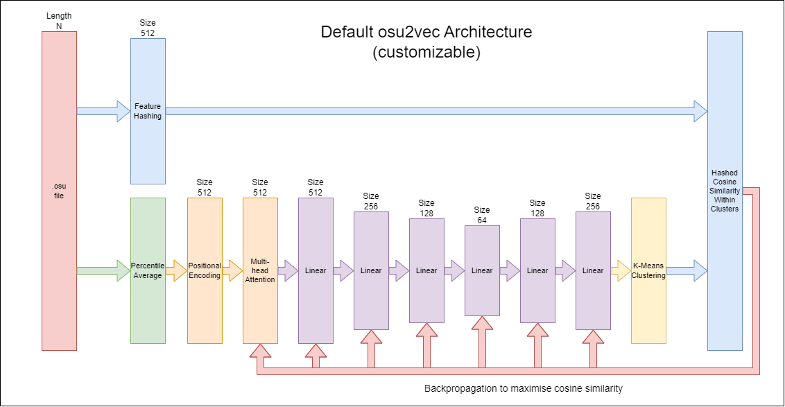

# osu2vec
Model trained using modern self-supervised techniques to convert an osu! beatmap to a vector representation. Includes an osu-to-csv parser, beatmap-to-vector embedding mechanism, and beatmap classifer trained through both unsupervised K-Means and/or supervised learning.

## Model Architecture

## Usage
Check out [USAGE.md](USAGE.md)!